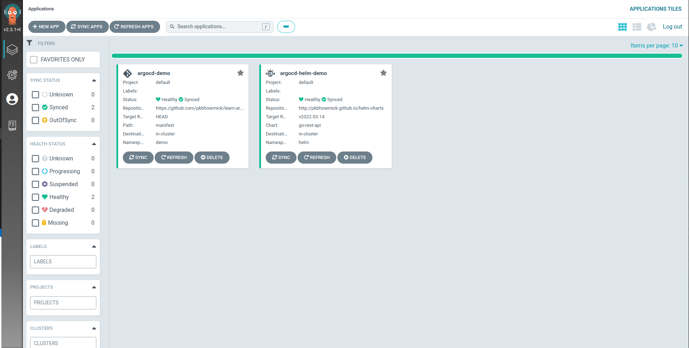
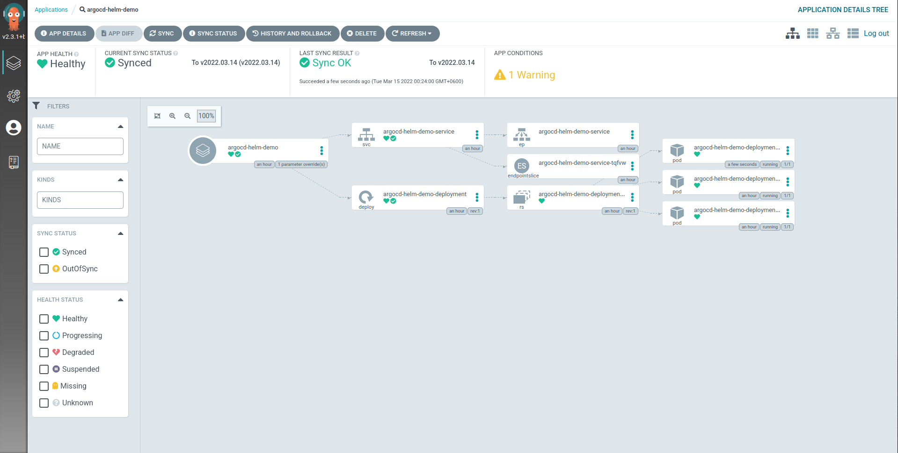

# learn-argocd

## Start With Basic

- [What is GitOps?](https://www.youtube.com/watch?v=f5EpcWp0THw)

- [ArgoCD Tutorial for Beginners](https://www.youtube.com/watch?v=MeU5_k9ssrs)

## Getting Started (Hands on demo)

(1) Create a git repository with the kubernetes manifest files. Here this repo is used as argo cd source git repo (manifest directory).

(2) Create ArgoCD Application custom resources yaml and apply it. Here yaml can be created manually or from the argocd UI(preferred).

Example Application yaml:

```yaml
apiVersion: argoproj.io/v1alpha1
kind: Application
metadata:
  name: argocd-demo
  namespace: argocd
spec:
  destination:
    namespace: demo
    server: https://kubernetes.default.svc
  project: default
  source:
    path: manifest
    repoURL: https://github.com/pkbhowmick/learn-argocd
    targetRevision: HEAD
  syncPolicy:
    automated:
      prune: true
      selfHeal: true
    syncOptions:
    - CreateNamespace=true
```

In the above yaml, `.spec.source` holds the source git repository, targetRevision (Here it is HEAD, the lasest commit), k8s yaml file path of the git repo.

`.spec.destination` holds the destination k8s server address and the namespace where argocd will create the resources given in source path. Here same k8s server is used the argocd is deployed.

Some more configuration is needed to update the k8s cluster with any update in git repository. To do this `selfHeal` is marked as true in `.spec.syncPolicy`(By default argocd don't automatically sync the cluster with git repo).

To save accidential deletion by defalut argo cd don't delete any k8s resources if any k8s yaml is deleted from git repo. To give deletion permission to argocd in case any yaml is deleted from git repo, `prune` is marked as true in `.spec.syncPolicy`.


(3) After applying the above yaml, we argo cd will deploy the yamls given in source (here an nginx deployment with image version 1.20 and a service is used first).

UI looks like below after argocd will have finised first sync.


Resource graph


(4) Then update the nginx image version from 1.20 to 1.21 in the git repository yaml. By default argocd pull the yamls from the git repository in every 3 minutes. In the next sync argocd will update the image version of the deployment in the k8s server.

After changing the nginx image version:


## Deep Dive into argocd 

- [argocd official doc](https://argo-cd.readthedocs.io/en/stable/)

- [argocd github repo](https://github.com/argoproj/argo-cd)

### Using Helm installation

A sample Application custom resource yaml using helm installation:

```yaml
apiVersion: argoproj.io/v1alpha1
kind: Application
metadata:
  name: argocd-helm-demo
  namespace: argocd
spec:
  destination:
    namespace: helm
    server: https://kubernetes.default.svc
  project: default
  source:
    chart: go-rest-api
    repoURL: http://pkbhowmick.github.io/helm-charts
    targetRevision: v2022.03.14
  syncPolicy:
    automated:
      prune: true
      selfHeal: true
    syncOptions:
    - CreateNamespace=true

```

which is almost identical with the yaml of git installation except the source. For helm installation `.spec.source` is a helm chart address with chart repo url, chart name and the chart version.

To modify default values, we can update the values from ui or from application custom resource.
Here is an example of Application CR with custom values. Here we have added the custom values in `.spec.source.helm.parameters`

```yaml
apiVersion: argoproj.io/v1alpha1
kind: Application
metadata:
  name: argocd-helm-demo
  namespace: argocd
spec:
  destination:
    namespace: helm
    server: https://kubernetes.default.svc
  project: default
  source:
    chart: go-rest-api
    helm:
      parameters:
      - name: Deployment.Replicas
        value: "3"
    repoURL: http://pkbhowmick.github.io/helm-charts
    targetRevision: v2022.03.14
  syncPolicy:
    automated:
      prune: true
      selfHeal: true
    syncOptions:
    - CreateNamespace=true

```

Application CR example with custom values file. In this case, values file should be in the same git repository where the chart is located.

```yaml
apiVersion: argoproj.io/v1alpha1
kind: Application
metadata:
  name: argocd-helm-demo
  namespace: argocd
spec:
  destination:
    namespace: helm
    server: https://kubernetes.default.svc
  project: default
  source:
    chart: go-rest-api
    helm:
      valueFiles:
        - custom-values.yaml
    repoURL: http://pkbhowmick.github.io/helm-charts
    targetRevision: v2022.03.14
  syncPolicy:
    automated:
      prune: true
      selfHeal: true
    syncOptions:
    - CreateNamespace=true
```

Some pictures of helm demo.



Resource graph of helm argocd demo.



